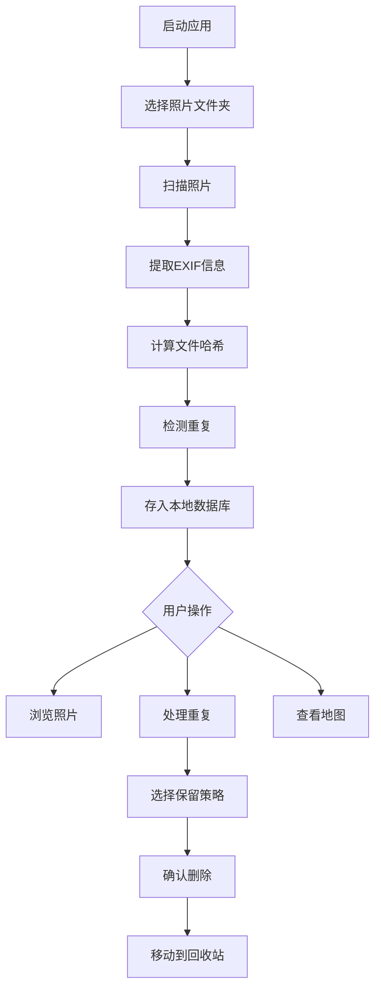

# 小呆画册 - 照片管理与去重应用

## 1. 产品概述

小呆画册是一款桌面照片管理应用，帮助用户整理多年积累的照片库。主要解决照片重复、分散存储、缺乏地理信息可视化等问题。目标用户是拥有大量照片需要整理的摄影爱好者和普通用户。

核心价值：一键去重、智能整理、地图可视化，让混乱的照片库变得井井有条。

## 2. 核心功能

### 2.1 功能模块

1. **照片库页面**：文件夹选择、照片扫描、索引管理
2. **浏览页面**：瀑布流展示、时间线浏览、筛选过滤
3. **去重页面**：重复检测、批量处理、保留推荐
4. **地图页面**：位置展示、地理聚合、无GPS照片管理

### 2.2 页面详情

| 页面名称 | 模块名称 | 功能描述 |
|---------|---------|---------|
| 照片库页面 | 文件夹管理 | 添加/移除监控文件夹，显示照片统计 |
| 照片库页面 | 扫描进度 | 实时显示扫描进度、已发现照片数、重复数 |
| 浏览页面 | 瀑布流展示 | 按时间排序的照片网格，支持缩放 |
| 浏览页面 | 筛选面板 | 按时间范围、位置、相机型号筛选 |
| 浏览页面 | 照片详情 | 显示EXIF信息、位置地图、相似照片 |
| 去重页面 | 重复列表 | 分组显示重复照片，标记推荐保留版本 |
| 去重页面 | 批量操作 | 一键删除重复、保留最新/最大/最高画质 |
| 地图页面 | 全球视图 | 在世界地图上显示所有有GPS的照片 |
| 地图页面 | 位置聚合 | 同一地点多张照片聚合显示 |
| 地图页面 | 无GPS管理 | 列出无GPS照片，支持手动标记位置 |

## 3. 核心流程

### 3.1 首次使用流程

用户打开应用 → 选择照片文件夹 → 系统扫描并建立索引 → 显示扫描结果（总数、重复数、有GPS数）→ 进入浏览页面

### 3.2 去重处理流程

用户点击"去重" → 系统显示重复分组 → 用户选择保留策略或手动选择 → 确认删除 → 移动到回收站

### 3.3 流程图

## 4. 用户界面设计

### 4.1 设计风格

- **主题**：深色主题为主，减少眼睛疲劳，突出照片内容
- **主色调**：深灰 (#1a1a1a) 背景 + 琥珀色 (#f59e0b) 强调色
- **辅助色**：蓝灰色用于次要元素，绿色用于成功状态，红色用于警告
- **字体**：使用 "DM Sans" 作为UI字体，清晰现代
- **布局**：左侧固定导航栏 + 右侧内容区域，顶部工具栏
- **卡片样式**：圆角 8px，微妙阴影，悬停时轻微放大
- **图标**：使用 Lucide Icons，线性风格，24px

### 4.2 页面设计概览

| 页面名称 | 模块名称 | UI元素 |
|---------|---------|--------|
| 照片库页面 | 文件夹管理 | 卡片列表，每个文件夹显示路径、照片数、最后扫描时间 |
| 照片库页面 | 扫描按钮 | 大型主按钮，琥珀色，带加载动画 |
| 浏览页面 | 瀑布流 | 响应式网格，照片间距 4px，悬停显示信息浮层 |
| 浏览页面 | 筛选栏 | 顶部固定，下拉选择器，日期范围选择 |
| 浏览页面 | 照片详情 | 右侧滑出面板，显示大图和EXIF信息 |
| 去重页面 | 重复分组 | 横向卡片组，每组显示所有重复版本，推荐版本高亮边框 |
| 去重页面 | 操作按钮 | 底部固定操作栏，批量删除、保留选择 |
| 地图页面 | 地图容器 | 全屏地图，照片标记为圆点，聚合为数字气泡 |
| 地图页面 | 照片列表 | 底部抽屉，显示当前选中位置的照片缩略图 |

### 4.3 响应式设计

- 桌面优先设计，最小支持 1280px 宽度
- 瀑布流列数自适应：1280px 4列，1600px 5列，1920px 6列
- 侧边栏可折叠，节省屏幕空间

### 4.4 交互设计

- **拖拽添加**：支持拖拽文件夹到应用窗口添加路径
- **快捷键**：空格预览、方向键切换、Delete删除
- **进度反馈**：扫描时显示进度条和当前处理文件名
- **操作确认**：删除操作需二次确认，支持撤销

## 5. 非功能性需求

### 5.1 性能要求

- 支持 10万+ 照片的库
- 首次扫描：1000张/分钟
- 界面响应：< 100ms
- 图片缩略图缓存，避免重复生成

### 5.2 数据安全

- 删除操作移动到系统回收站，可恢复
- 数据库存储在用户目录，不涉及网络传输
- 原始照片文件不被修改

### 5.3 兼容性

- 支持 Windows 10/11, macOS 11+
- 支持常见图片格式：JPG, PNG, HEIC, WEBP, RAW (部分)
