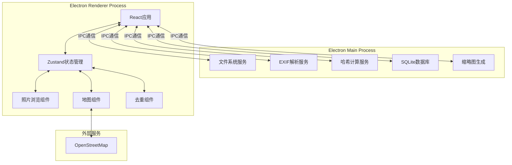
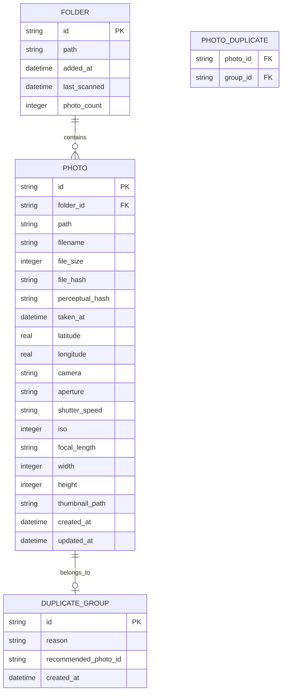

# 小呆相册 技术架构文档

## 1. 架构设计



## 2. 技术描述

### 2.1 核心技术栈

| 层级 | 技术选型 | 版本 | 说明 |
|-----|---------|------|------|
| 桌面框架 | Electron | ^28.x | 跨平台桌面应用 |
| 前端框架 | React | ^18.x | UI组件化开发 |
| 开发语言 | TypeScript | ^5.x | 类型安全 |
| 构建工具 | Vite | ^5.x | 快速开发构建 |
| 样式方案 | TailwindCSS | ^3.x | 原子化CSS |
| 状态管理 | Zustand | ^4.x | 轻量级状态管理 |
| 本地数据库 | better-sqlite3 | ^9.x | SQLite同步操作 |
| 图片处理 | sharp | ^0.33.x | 高性能图片处理 |
| EXIF解析 | exifr | ^7.x | 提取照片元数据 |
| 地图展示 | Leaflet + react-leaflet | ^1.9.x / ^4.x | 开源地图库 |
| 图标库 | Lucide React | ^0.3.x | 现代图标库 |

### 2.2 项目结构

```
photovault/
├── electron/
│   ├── main.ts              # Electron主进程入口
│   ├── preload.ts           # 预加载脚本，暴露IPC API
│   └── services/
│       ├── scanner.ts       # 文件夹扫描服务
│       ├── exif.ts          # EXIF解析服务
│       ├── hash.ts          # 哈希计算服务
│       ├── database.ts      # 数据库操作服务
│       └── thumbnail.ts     # 缩略图生成服务
├── src/
│   ├── main.tsx             # React入口
│   ├── App.tsx              # 应用根组件
│   ├── index.css            # 全局样式
│   ├── components/          # UI组件
│   │   ├── layout/          # 布局组件
│   │   ├── gallery/         # 照片浏览组件
│   │   ├── map/             # 地图组件
│   │   ├── duplicate/       # 去重组件
│   │   └── common/          # 通用组件
│   ├── stores/              # Zustand状态
│   ├── hooks/               # 自定义Hooks
│   ├── types/               # TypeScript类型定义
│   └── utils/               # 工具函数
├── public/                  # 静态资源
├── package.json
├── vite.config.ts
├── tailwind.config.js
└── tsconfig.json
```

## 3. 路由定义

使用 React Router 进行路由管理：

| 路由 | 组件 | 说明 |
|-----|------|------|
| `/` | LibraryPage | 照片库页面，文件夹管理 |
| `/browse` | BrowsePage | 照片浏览页面 |
| `/duplicates` | DuplicatesPage | 去重管理页面 |
| `/map` | MapPage | 地图展示页面 |

## 4. IPC 通信接口

### 4.1 文件扫描相关

```typescript
interface ScannerAPI {
  addFolder: (path: string) => Promise<ScanResult>;
  removeFolder: (id: string) => Promise<void>;
  getFolders: () => Promise<Folder[]>;
  startScan: (folderId: string) => Promise<void>;
  getScanProgress: () => Promise<ScanProgress>;
}

interface ScanResult {
  folderId: string;
  totalPhotos: number;
  newPhotos: number;
  duplicates: number;
}

interface ScanProgress {
  current: number;
  total: number;
  currentFile: string;
  status: 'scanning' | 'hashing' | 'complete' | 'idle';
}
```

### 4.2 照片数据相关

```typescript
interface PhotoAPI {
  getPhotos: (filter: PhotoFilter) => Promise<Photo[]>;
  getPhoto: (id: string) => Promise<PhotoDetail>;
  getDuplicates: () => Promise<DuplicateGroup[]>;
  deletePhotos: (ids: string[]) => Promise<void>;
  updatePhotoLocation: (id: string, lat: number, lng: number) => Promise<void>;
}

interface PhotoFilter {
  folderId?: string;
  dateRange?: [Date, Date];
  hasLocation?: boolean;
  camera?: string;
  limit?: number;
  offset?: number;
}

interface Photo {
  id: string;
  path: string;
  filename: string;
  thumbnail: string;
  takenAt: Date | null;
  latitude: number | null;
  longitude: number | null;
  width: number;
  height: number;
  fileSize: number;
  camera: string | null;
}

interface PhotoDetail extends Photo {
  fileHash: string;
  perceptualHash: string;
  aperture: string | null;
  shutterSpeed: string | null;
  iso: number | null;
  focalLength: string | null;
}

interface DuplicateGroup {
  id: string;
  photos: Photo[];
  recommendedId: string;
  reason: 'exact' | 'similar';
}
```

### 4.3 缩略图相关

```typescript
interface ThumbnailAPI {
  getThumbnail: (photoId: string, size: number) => Promise<string>;
  generateThumbnails: (photoIds: string[]) => Promise<void>;
}
```

## 5. 数据模型

### 5.1 数据模型定义



### 5.2 数据定义语言

```sql
CREATE TABLE folders (
    id TEXT PRIMARY KEY,
    path TEXT NOT NULL UNIQUE,
    added_at DATETIME DEFAULT CURRENT_TIMESTAMP,
    last_scanned DATETIME,
    photo_count INTEGER DEFAULT 0
);

CREATE TABLE photos (
    id TEXT PRIMARY KEY,
    folder_id TEXT NOT NULL,
    path TEXT NOT NULL UNIQUE,
    filename TEXT NOT NULL,
    file_size INTEGER,
    file_hash TEXT,
    perceptual_hash TEXT,
    taken_at DATETIME,
    latitude REAL,
    longitude REAL,
    camera TEXT,
    aperture TEXT,
    shutter_speed TEXT,
    iso INTEGER,
    focal_length TEXT,
    width INTEGER,
    height INTEGER,
    thumbnail_path TEXT,
    created_at DATETIME DEFAULT CURRENT_TIMESTAMP,
    updated_at DATETIME DEFAULT CURRENT_TIMESTAMP,
    FOREIGN KEY (folder_id) REFERENCES folders(id) ON DELETE CASCADE
);

CREATE TABLE duplicate_groups (
    id TEXT PRIMARY KEY,
    reason TEXT CHECK(reason IN ('exact', 'similar')),
    recommended_photo_id TEXT,
    created_at DATETIME DEFAULT CURRENT_TIMESTAMP,
    FOREIGN KEY (recommended_photo_id) REFERENCES photos(id)
);

CREATE TABLE photo_duplicates (
    photo_id TEXT,
    group_id TEXT,
    PRIMARY KEY (photo_id, group_id),
    FOREIGN KEY (photo_id) REFERENCES photos(id) ON DELETE CASCADE,
    FOREIGN KEY (group_id) REFERENCES duplicate_groups(id) ON DELETE CASCADE
);

CREATE INDEX idx_photos_folder ON photos(folder_id);
CREATE INDEX idx_photos_taken_at ON photos(taken_at);
CREATE INDEX idx_photos_hash ON photos(file_hash);
CREATE INDEX idx_photos_phash ON photos(perceptual_hash);
CREATE INDEX idx_photos_location ON photos(latitude, longitude);
CREATE INDEX idx_photos_camera ON photos(camera);
```

## 6. 核心算法

### 6.1 去重检测算法

```
1. 精确去重（MD5哈希）
   - 计算文件完整MD5哈希
   - 相同哈希值 = 完全相同的文件

2. 相似去重（感知哈希 pHash）
   - 缩放图片到 32x32 灰度
   - 计算DCT变换
   - 取左上角8x8区域
   - 生成64位哈希
   - 汉明距离 < 10 = 相似图片

3. 推荐保留策略
   - 优先保留有GPS信息的
   - 其次保留文件大小最大的
   - 再次保留分辨率最高的
   - 最后保留文件名最规范的
```

### 6.2 GPS坐标转换

EXIF中的GPS坐标格式为度分秒，需转换为十进制度：

```typescript
function convertDMSToDD(
  degrees: number,
  minutes: number,
  seconds: number,
  direction: 'N' | 'S' | 'E' | 'W'
): number {
  let dd = degrees + minutes / 60 + seconds / 3600;
  if (direction === 'S' || direction === 'W') {
    dd = -dd;
  }
  return dd;
}
```

## 7. 性能优化策略

### 7.1 缩略图缓存

- 首次扫描时生成 256px 缩略图
- 存储在用户目录 `.photovault/thumbnails/`
- 文件名使用照片ID，避免重复

### 7.2 虚拟滚动

- 瀑布流使用虚拟滚动，只渲染可见区域
- 使用 `react-virtualized` 或自定义实现

### 7.3 增量扫描

- 记录每个文件夹的最后扫描时间
- 二次扫描时只处理新增/修改的文件
- 使用文件的 mtime 判断是否需要更新

### 7.4 数据库优化

- 批量插入使用事务
- 定期执行 VACUUM 清理空间
- 使用 WAL 模式提高并发性能
